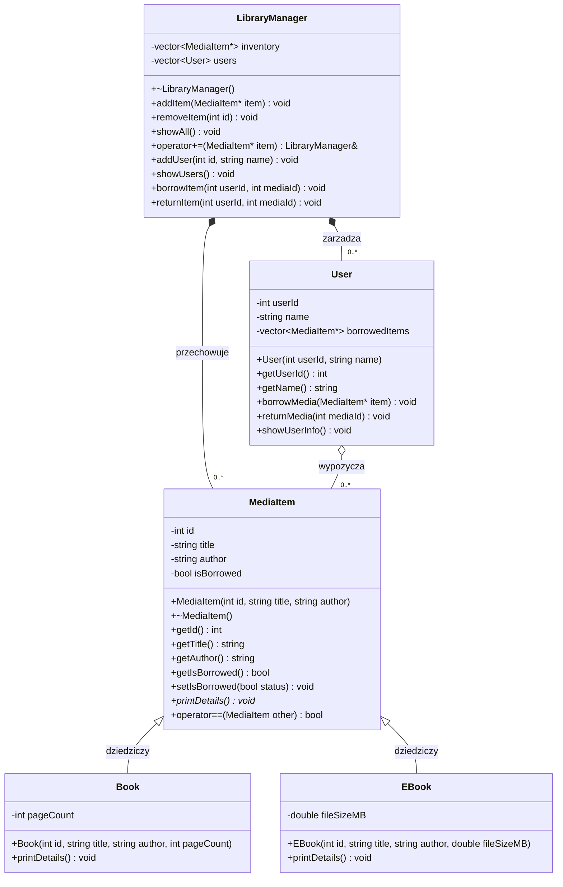

# Schemat klas UML

```mermaid
classDiagram
    class MediaItem {
        -int id
        -string title
        -string author
        -bool isBorrowed
        +MediaItem(int id, string title, string author)
        +~MediaItem()
        +getId() int
        +getTitle() string
        +getAuthor() string
        +getIsBorrowed() bool
        +setIsBorrowed(bool status) void
        +printDetails()* void
        +operator==(MediaItem other) bool
    }

    class Book {
        -int pageCount
        +Book(int id, string title, string author, int pageCount)
        +printDetails() void
    }

    class EBook {
        -double fileSizeMB
        +EBook(int id, string title, string author, double fileSizeMB)
        +printDetails() void
    }

    class User {
        -int userId
        -string name
        -vector~MediaItem*~ borrowedItems
        +User(int userId, string name)
        +getUserId() int
        +getName() string
        +borrowMedia(MediaItem* item) void
        +returnMedia(int mediaId) void
        +showUserInfo() void
    }

    class LibraryManager {
        -vector~MediaItem*~ inventory
        -vector~User~ users
        +~LibraryManager()
        +addItem(MediaItem* item) void
        +removeItem(int id) void
        +showAll() void
        +operator+=(MediaItem* item) LibraryManager&
        +addUser(int id, string name) void
        +showUsers() void
        +borrowItem(int userId, int mediaId) void
        +returnItem(int userId, int mediaId) void
    }

    MediaItem <|-- Book : dziedziczy
    MediaItem <|-- EBook : dziedziczy
    LibraryManager *-- "0..*" MediaItem : przechowuje
    LibraryManager *-- "0..*" User : zarzadza
    User o-- "0..*" MediaItem : wypozycza
```